<div align="center">

# 🔄 Enterprise MLOps Platform

### Production-Grade Credit Risk Scoring Lifecycle — End-to-End ML Automation

[](#quickstart)
[](#business-scenario)
[](https://python.org)
[](LICENSE)

---

**Orchestration & Compute**

[](https://www.kubeflow.org)
[](https://aws.amazon.com/eks/)
[](https://terraform.io)

**ML Tracking & Feature Engineering**

[](https://mlflow.org)
[](https://feast.dev)
[](https://dvc.org)

**Inference & Observability**

[](https://developer.nvidia.com/triton-inference-server)
[](https://www.evidentlyai.com)
[](https://fastapi.tiangolo.com)
[](https://react.dev)

</div>

---

## 📌 Overview

The **Enterprise MLOps Platform** is a production-grade, cloud-native machine learning operations console designed to automate the complete ML lifecycle for **credit risk scoring** in a regulated financial environment.

It demonstrates how leading banks and fintechs architect end-to-end ML systems — from feature engineering and automated retraining pipelines, to cryptographic audit trails, high-throughput inference, and statistical drift monitoring — all in a single, interactive control plane.

> **Tech stack**: Feast · MLflow · DVC · Kubeflow · XGBoost · Triton Inference Server · Evidently AI · FastAPI · React · AWS EKS · Terraform

---

## 📸 Platform Console — Live Screenshots

> The Enterprise MLOps Control Plane runs as a fully interactive React dashboard backed by a FastAPI telemetry server. All 5 operational domains are accessible via the navigation bar.

### 1️⃣ Feast Dual-Store Feature Engine

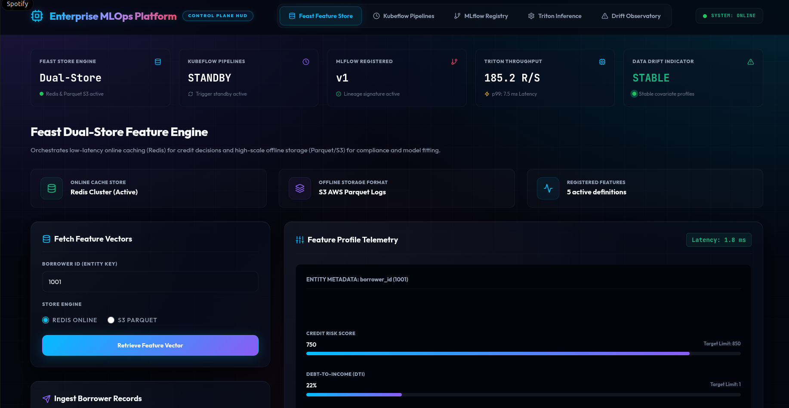

Fetch borrower feature vectors in real-time from Redis Online Cache (sub-5ms) or query the S3 Parquet offline store (~80ms). Ingest new borrower records directly into both stores simultaneously.

---

### 2️⃣ Kubeflow Pipeline Orchestration

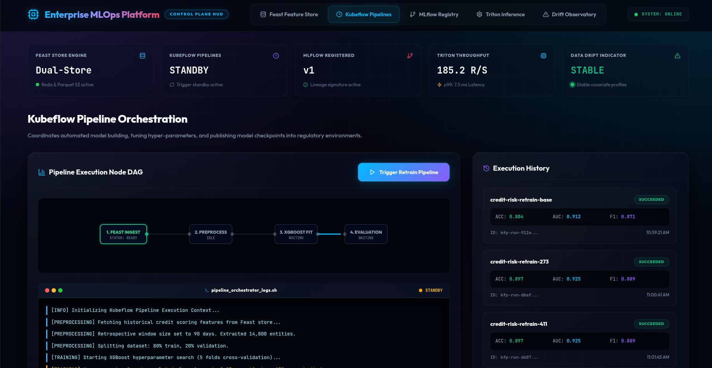

Visualize the 4-node training pipeline DAG (Ingest → Preprocess → XGBoost Fit → Evaluation). Trigger retraining runs and monitor live STDOUT log streams from the execution container.

---

### 3️⃣ MLflow Model Registry & Audit Lineage

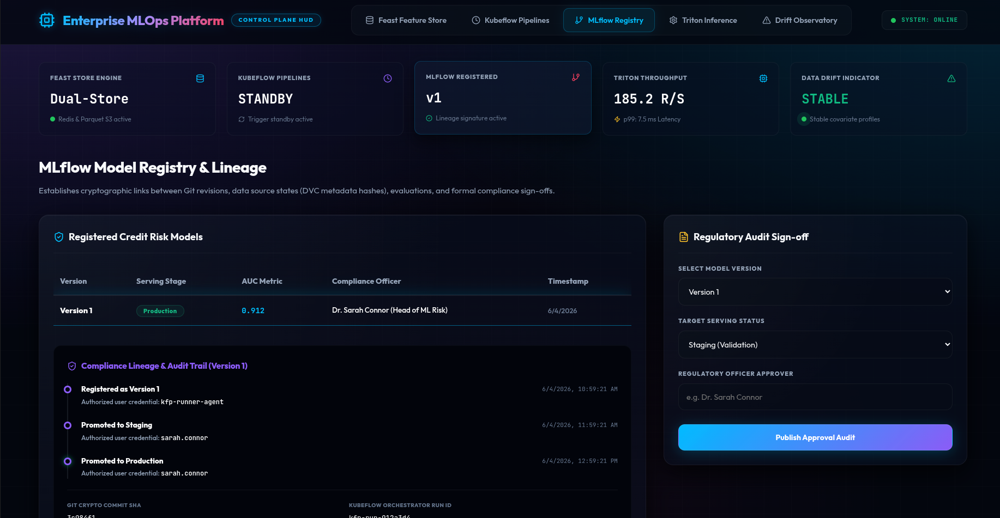

Track all registered credit risk model versions with their AUC metrics, serving stage (Production/Staging/Archived), and full cryptographic compliance lineage — Git commit SHAs, DVC dataset hashes, Kubeflow Run IDs, and regulatory sign-off signatures.

---

### 4️⃣ Triton Inference Serving Engine

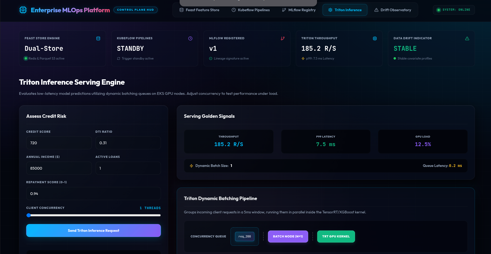

Submit credit risk prediction requests against the XGBoost model via the Triton-powered API. Adjust concurrency (1–32 threads) to observe dynamic batching behavior, GPU utilization, P99 latency, and throughput scaling in real time.

---

### 5️⃣ Evidently AI Drift Observatory

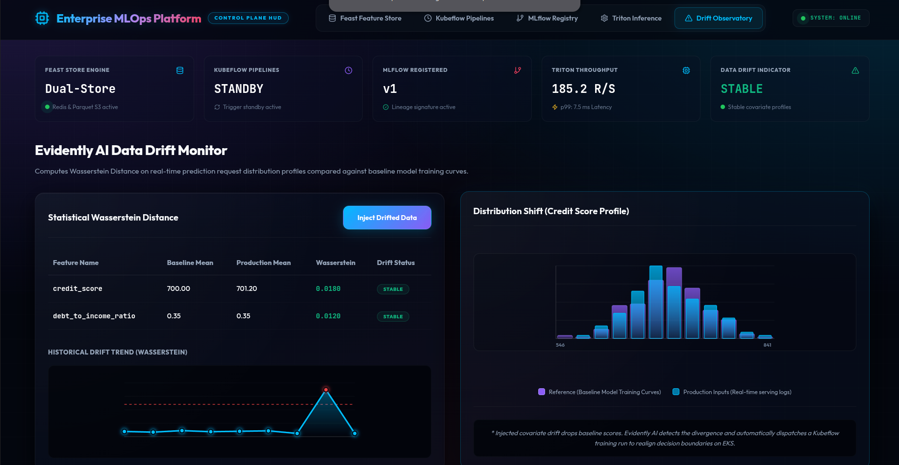

Monitor Wasserstein Distance distributions across all 5 feature parameters. Inject covariate drift to trigger the alarm and watch the autopilot self-healing retrain loop dispatch automatically.

---

## 🏗️ System Architecture

### High-Level Platform Topology

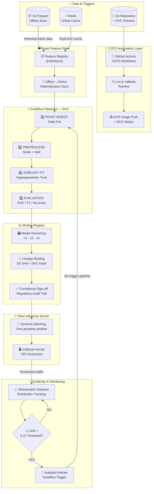

---

### ML Data Flow — Training Cycle

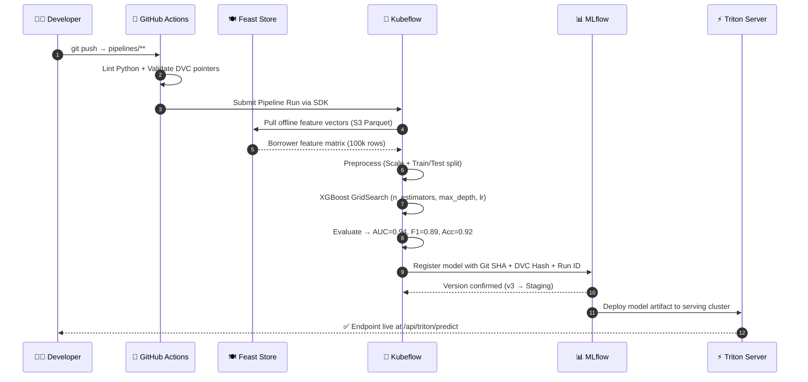

---

### Data Drift Auto-Healing Loop

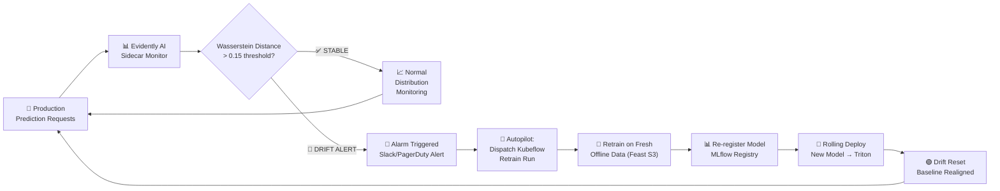

---

### Triton Inference Dynamic Batching

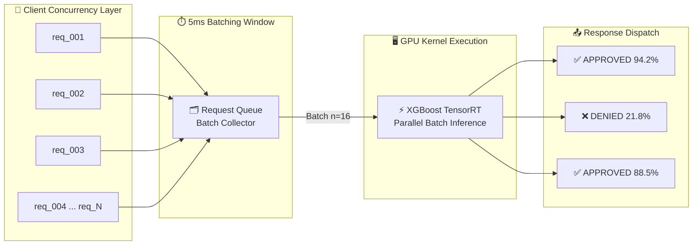

---

### CI/CD Pipeline Workflow

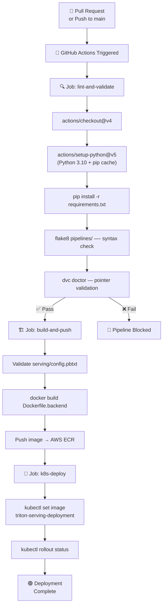

---

## ⚡ Key Architectural Features

| Feature | Technology | Detail |
|---|---|---|
| **Dual-Store Feature Serving** | Feast + Redis + S3 | Sub-5ms online cache vs 80ms offline Parquet queries |
| **Cryptographic Lineage** | MLflow + DVC + Git | Every model version linked to Git SHA, DVC hash, and Kubeflow Run ID |
| **Dynamic Batching** | Triton Inference Server | Groups requests in 5ms window → maximizes GPU throughput |
| **Auto-Healing Loop** | Evidently AI + Kubeflow | Wasserstein drift > 0.15 triggers automatic retraining pipeline |
| **Regulatory Audit Trail** | MLflow + Sign-off API | Human compliance approval required before Production promotion |
| **Infrastructure as Code** | Terraform | VPC, EKS cluster, node pools, Redis all provisioned declaratively |

---

## 📂 Repository Structure

```
11-enterprise-mlops-platform/
│
├── 📄 README.md                    # This guide
├── 🐳 Dockerfile.backend           # FastAPI + MLOps Python server
├── 🐳 Dockerfile.frontend          # React + Nginx static bundle
├── 🐳 docker-compose.yml           # Local development cluster
├── 📋 requirements.txt             # Python dependencies (CI/CD + Docker)
├── 🚀 start.sh                     # Bootstrap all platform services
├── 🛑 stop.sh                      # Teardown all containers + networks
│
├── 📁 .github/
│   └── workflows/
│       ├── train_pipeline.yml      # CI: Lint → DVC validate → Kubeflow trigger
│       └── deploy_serving.yml      # CD: Triton config validate → ECR → EKS deploy
│
├── 📁 terraform/
│   ├── main.tf                     # VPC, EKS cluster, Redis ElastiCache, node pools
│   └── variables.tf                # Parameterized environment variables
│
├── 📁 feature_store/
│   ├── feature_store.yaml          # Feast provider + offline/online store config
│   └── definitions.py              # Entity, FeatureView, and feature definitions
│
├── 📁 pipelines/
│   ├── preprocess.py               # Data scaling, normalization, train/test split
│   ├── train.py                    # XGBoost GridSearch + MLflow autologging
│   └── pipeline.py                 # Kubeflow SDK pipeline compiler & DAG wiring
│
├── 📁 serving/
│   └── config.pbtxt                # Triton model config: inputs, outputs, dynamic batching
│
├── 📁 assets/
│   ├── FeastFeatureStore.png       # Console screenshots
│   ├── KubeflowOrchestration.png
│   ├── MLflowRegistry.png
│   ├── TritonServing.png
│   └── DriftObservatory.png
│
└── 📁 monitoring/
    ├── drift_service.py            # FastAPI backend: telemetry, drift math, API routes
    └── dashboards/                 # React control plane UI (Vite + Lucide + SVG charts)
        ├── src/
        │   ├── App.jsx             # 5-tab MLOps dashboard: Feature→Pipeline→Registry→Triton→Drift
        │   └── index.css           # Cyber-dark HUD glassmorphism design system
        └── package.json
```

---

## 📋 Business Scenario

In commercial banking, deploying ML models for credit risk scoring is **highly regulated** (SR 11-7, Basel III, ECOA). Models cannot be silent black boxes.

To satisfy strict financial audits, this platform enforces:

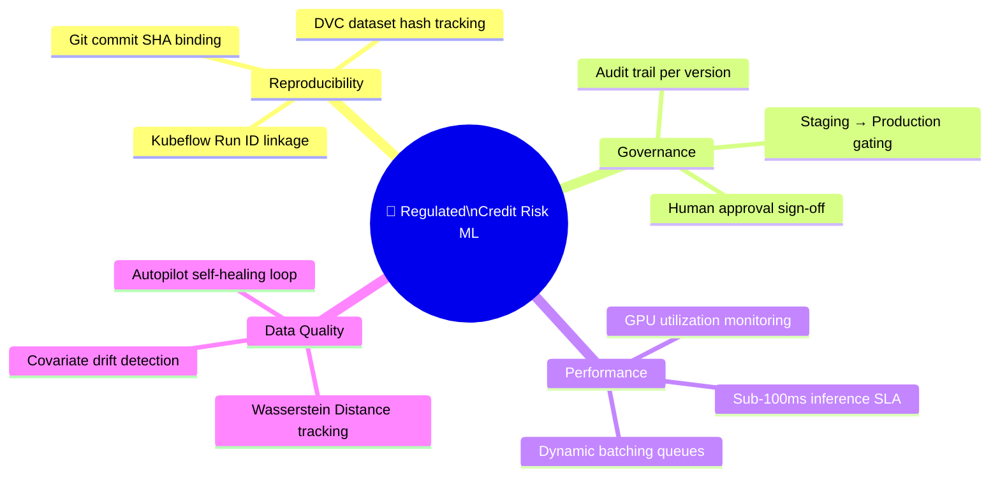

---

## 🚀 Local Quickstart

### Prerequisites

- [Docker Desktop](https://docs.docker.com/get-docker/) (with Compose)
- Port `3000` and `8000` must be free

### Step 1 — Bootstrap the Platform

```bash
# Clone the repository
git clone https://github.com/humeshdeshmukh/enterprise-mlops-platform.git
cd enterprise-mlops-platform

# Bootstrap all Docker services (builds backend + frontend containers)
chmod +x start.sh stop.sh
./start.sh
```

The bootstrap script will:
1. Create the `mlops-net` Docker bridge network
2. Build and start the **FastAPI MLOps backend** (port `8000`)
3. Build and deploy the **React Control Plane** via Nginx (port `3000`)
4. Health-check the backend before reporting success

### Step 2 — Access the Control Plane

| Interface | URL | Description |
|---|---|---|
| 🖥️ **React Dashboard** | http://localhost:3000 | Interactive MLOps control plane |
| 📜 **API Swagger Docs** | http://localhost:8000/docs | FastAPI auto-generated REST docs |
| 🩺 **Health Check** | http://localhost:8000/health | Backend liveness status |

### Step 3 — Teardown

```bash
./stop.sh
```

---

## 🎯 Simulation Scenarios (Recruiter Demo Guide)

### Scenario 1 — Feast Caching Benchmark

```
Tab: Feast Feature Store
1. Enter Borrower ID: 1001
2. Select: S3 Offline Parquet  → fetch → note latency ~80ms
3. Select: Redis Online Cache  → fetch → note latency <5ms
   ✅ Demonstrates: Low-latency online feature serving for real-time credit decisions
```

### Scenario 2 — Triton Throughput Scaling

```
Tab: Triton Inference
1. Set concurrency slider to 1 → Submit → note P99 ~5.2ms
2. Set concurrency slider to 24 → Submit
   → Watch: Batch Queue fills up with req_200 to req_224
   → Batch Group (n=16) processes together in one GPU kernel
   → Throughput increases, P99 stays sub-10ms
   ✅ Demonstrates: Dynamic batching efficiency under high concurrency
```

### Scenario 3 — Silent Drift → Autopilot Recovery

```
Tab: Drift Observatory
1. Note stable Wasserstein distances for all 5 features
2. Click: [Inject Drifted Data]
   → Alert banner fires: "SILENT DATA COVARIATE DRIFT ALARM"
   → Production distribution shifts left vs baseline reference curve
   → Wasserstein distance crosses 0.15 threshold (highlighted red)
   → "Autopilot Retrain Loop Active" badge activates

Tab: Kubeflow Pipelines
3. See retrain logs streaming: FEAST INGEST → PREPROCESS → XGBOOST FIT → EVALUATION

Tab: MLflow Registry
4. New model version registered + promoted to Production
   → Drift resets, self-healing loop complete
   ✅ Demonstrates: End-to-end auto-recovery from data drift
```

### Scenario 4 — Compliance Audit Sign-off

```
Tab: MLflow Registry
1. Click on a model version to inspect its lineage
   → Git Commit SHA, DVC Cryptographic Hash, Kubeflow Run ID all visible
2. Select a version from the Regulatory Sign-off form
3. Enter target status: Production
4. Enter approver name: Dr. Sarah Connor
5. Click: [Publish Approval Audit]
   ✅ Demonstrates: Regulated model governance with human-in-the-loop sign-off
```

---

## 🧠 Skills Demonstrated

| Domain | Skill |
|---|---|
| **MLOps Engineering** | End-to-end CI/CD/CT pipeline design (GitHub Actions → Kubeflow → MLflow) |
| **Feature Engineering** | Feast dual-store architecture: offline batch + online low-latency cache |
| **ML Governance** | Cryptographic lineage, audit trails, regulatory compliance sign-off workflows |
| **Inference Optimization** | Triton dynamic batching, GPU concurrency, P99 latency benchmarking |
| **Data Observability** | Statistical drift detection (Wasserstein Distance), alert systems, auto-recovery |
| **Infrastructure as Code** | Terraform for VPC, EKS cluster, Redis, and node pool provisioning |
| **Backend Engineering** | FastAPI REST API design, async telemetry server, structured data simulation |
| **Frontend Engineering** | React + Vite control plane with real-time SVG charts and glassmorphic UI |

---

## 🔗 Related Resources

- [Feast Feature Store Documentation](https://docs.feast.dev)
- [MLflow Model Registry Guide](https://mlflow.org/docs/latest/model-registry.html)
- [Kubeflow Pipelines SDK](https://www.kubeflow.org/docs/components/pipelines/)
- [Triton Inference Server Docs](https://docs.nvidia.com/deeplearning/triton-inference-server/user-guide/docs/)
- [Evidently AI Drift Reports](https://docs.evidentlyai.com)
- [AWS EKS Best Practices](https://aws.github.io/aws-eks-best-practices/)

---

<div align="center">

**Built for production-grade MLOps demonstration**

⭐ Star this repository if it helped you learn enterprise ML engineering patterns!

</div>
